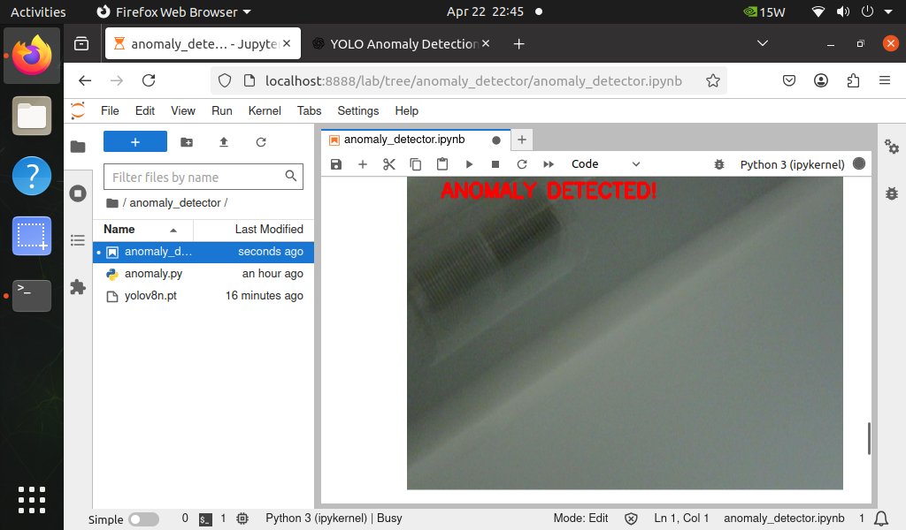
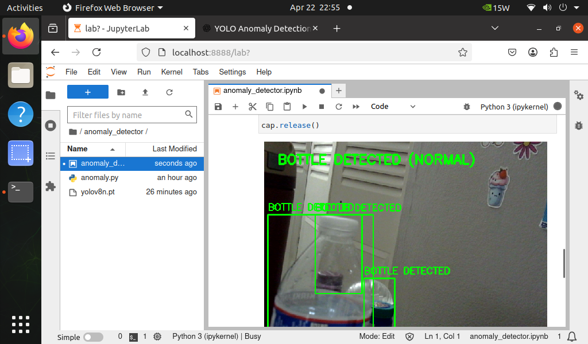

<div align="center">

```
██╗   ██╗ ██████╗ ██╗      ██████╗      █████╗ ███╗   ██╗ ██████╗ ███╗   ███╗ █████╗ ██╗  ██╗   ██╗
╚██╗ ██╔╝██╔═══██╗██║     ██╔═══██╗    ██╔══██╗████╗  ██║██╔═══██╗████╗ ████║██╔══██╗██║  ╚██╗ ██╔╝
 ╚████╔╝ ██║   ██║██║     ██║   ██║    ███████║██╔██╗ ██║██║   ██║██╔████╔██║███████║██║   ╚████╔╝ 
  ╚██╔╝  ██║   ██║██║     ██║   ██║    ██╔══██║██║╚██╗██║██║   ██║██║╚██╔╝██║██╔══██║██║    ╚██╔╝  
   ██║   ╚██████╔╝███████╗╚██████╔╝    ██║  ██║██║ ╚████║╚██████╔╝██║ ╚═╝ ██║██║  ██║███████╗██║   
   ╚═╝    ╚═════╝ ╚══════╝ ╚═════╝     ╚═╝  ╚═╝╚═╝  ╚═══╝ ╚═════╝ ╚═╝     ╚═╝╚═╝  ╚═╝╚══════╝╚═╝  
                                                                                          DETECTOR
```

# ⬡ YOLO Real-Time Anomaly Detector

### *Deployed on NVIDIA Jetson Nano via Docker · YOLOv8 · JupyterLab*

---


---

> **Real-Time AI Systems · UMBC · Spring 2025**  
> A fully containerized real-time anomaly detection pipeline running YOLOv8 on edge hardware.  
> Detects objects live via webcam and instantly flags anomalies with visual overlays — all from inside a Docker container on the Jetson Nano.

</div>

---

## 📋 Table of Contents

- [Overview](#-overview)
- [Demo Screenshots](#-demo-screenshots)
- [System Architecture](#-system-architecture)
- [Docker Deployment](#-docker-deployment)
- [Project Structure](#-project-structure)
- [Results](#-results)
- [Author](#-author)

---

## 🎯 Overview

This project builds a **real-time object anomaly detection system** using **YOLOv8n** running inside a **Docker container** on the **NVIDIA Jetson Nano (4GB)**. 

The notebook UI runs live inside **JupyterLab** served from within the container — no local Python environment needed. The webcam feed is processed frame-by-frame, with detections classified as either:

| State | Visual | Description |
|---|---|---|
| 🔴 **ANOMALY** | Red overlay + red border | Object matches anomaly class list |
| 🟢 **NORMAL** | Green bounding boxes | Known object detected, not flagged |
| ⚪ **NONE** | No overlay | No object detected in frame |

---

## 🖥️ Demo Screenshots

<table>
  <tr>
    <td align="center"><b>⚠️ Anomaly Detected</b></td>
    <td align="center"><b>✅ Normal Detection</b></td>
  </tr>
  <tr>
    <td></td>
    <td></td>
  </tr>
  <tr>
    <td align="center"><i>Red overlay — "ANOMALY DETECTED!" triggered on anomalous frame</i></td>
    <td align="center"><i>Green bounding boxes — "BOTTLE DETECTED (NORMAL)"</i></td>
  </tr>
</table>

---

## 🏗️ System Architecture

```
┌─────────────────────────────────────────────────────────┐
│              DOCKER CONTAINER                           │
│         nvcr.io/nvidia/l4t-pytorch                      │
│                                                         │
│   ┌─────────────────────────────────────────────────┐   │
│   │              JupyterLab  :8888                  │   │
│   │                                                 │   │
│   │      anomaly_detector.ipynb                     │   │
│   │               │                                 │   │
│   │    ┌──────────▼──────────┐                      │   │
│   │    │  cv2.VideoCapture   │ ◄── /dev/video0      │   │
│   │    └──────────┬──────────┘      (webcam)        │   │
│   │               │                                 │   │
│   │    ┌──────────▼──────────┐                      │   │
│   │    │    YOLOv8n Model    │ ◄── yolov8n.pt       │   │
│   │    └──────────┬──────────┘                      │   │
│   │               │                                 │   │
│   │        Detected Labels                          │   │
│   │               │                                 │   │
│   │    ┌──────────┴──────────┐                      │   │
│   │   YES                   NO                      │   │
│   │    ▼                     ▼                      │   │
│   │  🔴 Red Overlay       🟢 Green Boxes            │   │
│   │  "ANOMALY DETECTED!"  "X DETECTED (NORMAL)"     │   │
│   │               │                                 │   │
│   │    ┌──────────▼──────────┐                      │   │
│   │    │  ipywidgets Display │ ──► Browser UI       │   │
│   │    └─────────────────────┘                      │   │
│   └─────────────────────────────────────────────────┘   │
└─────────────────────────────────────────────────────────┘
          │                              │
   GPU passthrough                  Port 8888
   (--runtime nvidia)           (localhost:8888)
```

---

## 🐳 Docker Deployment

### Step 1 — Pull the Image

```bash
docker pull nvcr.io/nvidia/l4t-pytorch:r32.7.1-pth1.10-py3
```

> 💡 This is NVIDIA's official **L4T (Linux for Tegra)** PyTorch image — built specifically for Jetson Nano with JetPack 4.6.

---

### Step 2 — Run the Container

```bash
docker run -it --rm \
  --runtime nvidia \
  --device /dev/video0 \
  -p 8888:8888 \
  -v $(pwd):/workspace \
  nvcr.io/nvidia/l4t-pytorch:r32.7.1-pth1.10-py3
```

| Flag | Purpose |
|---|---|
| `--runtime nvidia` | Enable GPU passthrough |
| `--device /dev/video0` | Pass webcam into container |
| `-p 8888:8888` | Expose JupyterLab to host browser |
| `-v $(pwd):/workspace` | Mount project files |

---

### Step 3 — Install Dependencies Inside Container

```bash
pip install ultralytics ipywidgets jupyterlab --quiet
```

---

### Step 4 — Launch JupyterLab

```bash
jupyter lab --ip=0.0.0.0 --port=8888 --no-browser --allow-root
```

Then open your browser at:

```
http://localhost:8888
```

---

### Step 5 — Open & Run the Notebook

```
anomaly_detector.ipynb  →  Run All Cells  →  Press ▶ START
```

---

## 📁 Project Structure

```
anomaly_detector/
│
├── 📓 anomaly_detector.ipynb   # Main notebook — full UI + detection loop
├── 🐍 anomaly.py               # Standalone script version
├── 🤖 yolov8n.pt               # YOLOv8 nano pretrained weights
│
├── 🖼️  anomaly_detected.png    # Screenshot — anomaly triggered
├── 🖼️  detected.png            # Screenshot — normal bottle detection
│
└── 📄 README.md
```

---

## 📊 Results

| Metric | Value |
|---|---|
| 🤖 Model | YOLOv8n |
| 💻 Device | NVIDIA Jetson Nano 4GB |
| 🐳 Runtime | Docker — NVIDIA L4T PyTorch |
| ⚡ Avg FPS (Jetson) | ~4–6 FPS |
| 🎯 Confidence Threshold | 0.40 |
| 🔴 Anomaly Example | Dark / unrecognized frame → **ANOMALY DETECTED!** |
| 🟢 Normal Example | Bottle → **BOTTLE DETECTED (NORMAL)** |

---

## ⚙️ Customization

Edit these variables at the top of the notebook to configure the system:

```python
MODEL_PATH      = "yolov8n.pt"                            # model weights path
ANOMALY_CLASSES = ["knife", "scissors", "gun", "laptop"]  # what triggers an alert
CONF_THRESHOLD  = 0.40                                    # detection confidence cutoff
```

---

## 👩‍💻 Author

<div align="center">

**Samu**  
M.S. Data Science — University of Maryland, Baltimore County (UMBC)  
Real-Time AI Systems · Spring 2025

[](https://github.com/your-username)

</div>

---

<div align="center">

*Built with YOLOv8 · Docker · NVIDIA Jetson Nano · JupyterLab*

</div>
